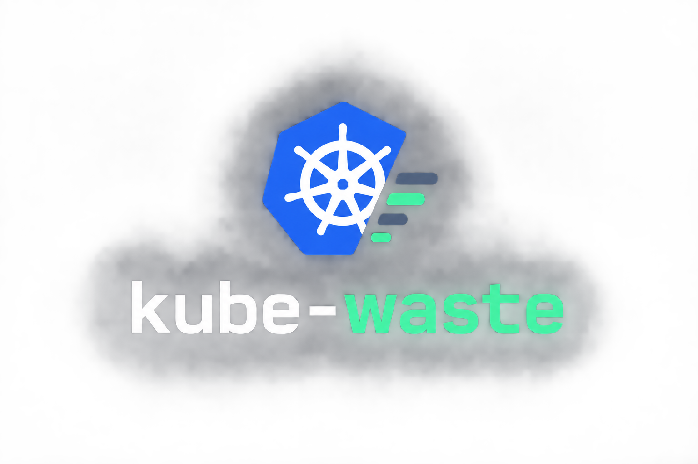
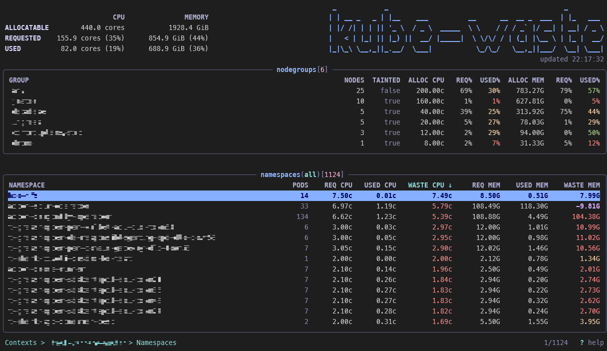

<p align="center">
  
</p>

# kube-waste

A read-only terminal UI for finding wasted CPU and memory requests in Kubernetes clusters.

`kube-waste` compares what your workloads **request** against what they actually **use**
(via `metrics.k8s.io`) and shows the difference, the waste, per cluster, per namespace
and per pod. It never writes to the Kubernetes API.



## What it shows

**Cluster overview** (header): allocatable, requested and used CPU/memory for the whole
cluster, with requests and usage as a percentage of allocatable capacity.

**Node groups**: nodes aggregated by node pool, with node count, whether the pool is
tainted, allocatable capacity and request/usage pressure. Groups are detected in this
order:

1. node labels from your config file (`nodeGroupLabels`)
2. well-known node-pool labels: `cloud.google.com/gke-nodepool`, `eks.amazonaws.com/nodegroup`,
   `karpenter.sh/nodepool`, `kubernetes.azure.com/agentpool`, `agentpool`,
   `node.kubernetes.io/instancegroup`, `nodepool`, `node-pool`, `node-group`
3. `node-role.kubernetes.io/*` labels
4. the node name with generated suffixes stripped

**Namespaces**: pod count, requested / used / wasted CPU and memory.

**Pods**: node placement plus requested / used / wasted CPU and memory for the selected
namespace.

Waste is coloured by how much of the request is unused: green below 50%, yellow above 50%,
red above 80%. Pods using *more* than they request are highlighted separately.

### How requests are calculated

- Regular containers run concurrently, so their requests are summed.
- Restartable init containers (sidecars) are summed as well.
- Ordinary init containers run sequentially, so only the largest one counts, together with
  the sidecars started before it.
- `spec.overhead` is added on top.
- Succeeded, failed and unscheduled pods are ignored; they reserve nothing.

## Install

Requires Go 1.26+.

```sh
go install github.com/uozalp/kube-waste/cmd/kube-waste@latest
```

Or build from source:

```sh
make build     # produces bin/kube-waste
```

## Usage

```sh
kube-waste                              # pick a context from the kubeconfig
kube-waste --context prod-eu            # start directly in a context
kube-waste --kubeconfig ~/.kube/other   # use a specific kubeconfig
kube-waste --config ./kube-waste.yaml   # use a specific config file
```

### CLI options

| Flag | Description |
| --- | --- |
| `--context <name>` | Start directly in this kubeconfig context. The context list is skipped and `esc` quits instead of going back. |
| `--kubeconfig <path>` | Path to the kubeconfig file. Defaults to the normal client-go discovery (`$KUBECONFIG`, then `~/.kube/config`). |
| `--config <path>` | Path to the kube-waste config file. Defaults to `~/.config/kube-waste/config.yaml`. |
| `--scope <scope>` | Print data instead of starting the TUI: `overview`, `namespace` or `pod`. |
| `--output <format>` | Output format for `--scope`: `json` or `csv`. Defaults to `json`. |
| `--nodegroup <name>` | Limit the `--scope` output to a single node group. |

### Environment

| Variable | Effect |
| --- | --- |
| `KUBECONFIG` | Standard kubeconfig discovery, used when `--kubeconfig` is not given. |
| `XDG_CONFIG_HOME` | Changes the default config directory. |
| `NO_COLOR` | Disables all colouring. |

## Machine-readable output

`--scope` (or `--output`) turns kube-waste into a one-shot data source. stdout
carries nothing but the report; diagnostics go to stderr and a failed collection
exits non-zero.

```sh
kube-waste --context prod --scope overview --output json     # node groups, fast path
kube-waste --context prod --scope namespace --output csv     # one row per namespace
kube-waste --context prod --scope pod --output csv           # one row per pod
kube-waste --context prod --scope overview --nodegroup worker --output json
```

`overview` is the path meant for a tmux status bar or a polling daemon: it only
queries nodes, node metrics and pods, skipping the pod metrics and namespace
list the node-group aggregation never reads.

```json
{
  "context": "prod",
  "timestamp": "2026-09-11T21:00:00Z",
  "nodegroups": {
    "worker": {
      "cpu": { "requested": 32.4, "used": 12.8, "waste": 19.6, "percent": 39.5 },
      "memory": { "requested": 128.5, "used": 74.2, "waste": 54.3, "percent": 57.7 }
    }
  }
}
```

```sh
jq -r '.nodegroups.worker.cpu.percent' prod.json
```

CPU is reported in cores, memory in GiB, and percentages as plain numbers - no
units or `%` are ever added. `waste` is `requested - used` and is not clamped, so
usage above the request stays negative. When metrics.k8s.io is unavailable,
`used`, `waste` and `percent` are `null` in JSON and empty in CSV rather than
zero.

## Keyboard shortcuts

| Key | Action |
| --- | --- |
| `↑` / `k` | Move up |
| `↓` / `j` | Move down |
| `←` / `h` | Previous sort column |
| `→` / `l` | Next sort column |
| `pgup` / `ctrl+b` | Page up |
| `pgdn` / `ctrl+f` | Page down |
| `g` / `home` | First row |
| `G` / `end` | Last row |
| `enter` | Open the selected item (context → namespaces → pods) |
| `esc` | Clear the filter, otherwise go back one screen |
| `r` | Refresh the current screen |
| `/` | Filter the current table |
| `s` | Next sort column |
| `S` | Reverse the sort order |
| `c` | Sort by wasted CPU (press again to flip direction) |
| `m` | Sort by wasted memory (press again to flip direction) |
| `n` | Show / hide the node-groups section |
| `?` | Toggle help |
| `q` / `ctrl+c` | Quit |

While filtering, `enter` applies the filter, `esc` clears it, `backspace` deletes a
character and `ctrl+u` clears the input.

## Configuration

Optional. Default location: `~/.config/kube-waste/config.yaml` (honours `XDG_CONFIG_HOME`).

```yaml
# Node label keys tried, in order, before the built-in node-pool label and
# node-role detection. Nodes without any of them fall back to the built-in chain.
nodeGroupLabels:
  - node.example.com/workload
  - topology.kubernetes.io/zone
```

Unknown keys are rejected, so typos surface immediately.

## Permissions

Read-only access is enough:

| API group | Resources | Verbs |
| --- | --- | --- |
| `""` (core) | `nodes`, `pods`, `namespaces` | `get`, `list` |
| `metrics.k8s.io` | `nodes`, `pods` | `get`, `list` |

Without `metrics.k8s.io` (no metrics-server installed, or no access) the tool still runs:
requests and allocatable capacity are shown, and usage and waste render as `N/A` with a
warning in the header.